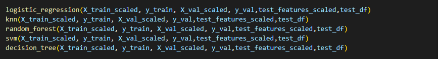
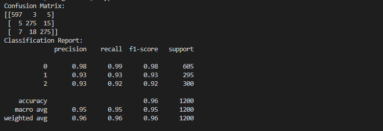

# Coursework mq1n22
## Task1 
****

1. Data Preprocessing: Load the training data (TrainingDataBinary.csv) and testing data (TestingDataBinary.csv) in my project. Separate the features (128 numbers) and labels (0 or 1) in the training data.

   

2. Divide 80% of the training data into a training set(X_train, X_val) and the rest into a validation set(y_train, y_val).
   

3. Feature scaling. Use StandardScaler() function in sklearn to standlize the data.
   
   

4. Model Selection: Choose an appropriate machine learning algorithm for binary classification. Some popular choices include Logistic Regression, Random Forest, Support Vector Machines, decision tree and Knn. Bring the data into the above models and try one by one.
   
   

5. Model Training: Train the selected model using the labeled training data. Split the training data into training and validation subsets to evaluate the model's performance during training. Use appropriate evaluation metrics such as accuracy, precision, recall to assess the model's performance.
   

6. Model Evaluation: Evaluate the trained model on the validation set and analyze the training error and accuracy. Adjust the model hyperparameters, if necessary, to optimize its performance. Tried all the models, Random Forest gave the best result and  Random Forest was chosen to be the final model.

    

    

7. Prediction on Testing Data: Once the model is trained and tuned, use it to predict the labels for the testing data. Output the predicted labels in the same order as given.
   ```
    Testing Results:
    1  1  1  1  1  1  1  1  1  1  1  1  1  1  1  1  1  1  1  1  1  0  1  1  1  1  1  1  1  1  1  1  1  1  1  1  1  1  1  1  1  1  1  1  1  1  1  1  1  1  0  0  0  0  0  0  0  0  0  0  0  0  0  0  0  0  0  0  1  1  1  1  1  1  1  0  0  0  0  0  0  0  0  0  0  0  0  0  0  0  0  0  0  0  0  0  0  0  0  0

   ```
   

7. Generate Testing Results File: Create a file (RandomForestTestingResultsBinary.csv) with the same format as the training data, including the computed labels for each system trace in the testing data.

***********

## Task2(Most of the steps are consistent with Task1)

1. Data Preprocessing: Load the training data (TrainingDataMulti.csv) and testing data (TestingDataMulti.csv) in my project. Separate the features (128 numbers) and labels (0 1 2) in the training data.

   

2. Divide 80% of the training data into a training set(X_train, X_val) and the rest into a validation set(y_train, y_val).
   
    

3. Feature scaling. Use StandardScaler() function in sklearn to standlize the data.
   
   

4. Model Selection: Choose an appropriate machine learning algorithm for binary classification. Some popular choices include Logistic Regression, Random Forest, Support Vector Machines, decision tree and Knn. Bring the data into the above models and try one by one.
   
    

5. Model Training: Train the selected model using the labeled training data. Split the training data into training and validation subsets to evaluate the model's performance during training. Use appropriate evaluation metrics such as accuracy, precision, recall to assess the model's performance.
   


   **logistic_regression:** 

    

   **knn:**

    

   **random forest:**

    

   **svm:**

    

   **decision tree:**

    

   To sum up, we choose random forest as the final model. 

6. Model Evaluation: Evaluate the trained model on the validation set and analyze the training error and accuracy. Adjust the model hyperparameters, if necessary, to optimize its performance. Tried all the models, Random Forest gave the best result and  Random Forest was chosen to be the final model.
   
   

   

7. Prediction on Testing Data: Once the model is trained and tuned, use it to predict the labels for the testing data. Output the predicted labels in the same order as given.
   ```
    Testing Results:
    2  2  2  2  2  2  1  1  2  2  2  1  1  1  1  1  2  1  1  1  1  2  2  2  2  2  2  2  2  2  0  2  0  1  1  1  1  1  2  1  1  1  1  2  2  2  2  2  2  1  2  2  2  1  2  2  2  1  1  1  1  1  1  1  1  1  0  0  0  0  0  0  0  0  0  0  0  0  0  0  0  0  0  0  1  1  1  1  1  1  1  0  0  0  0  0  0  0  0  0

   ```
   

8. Generate Testing Results File: Create a file (RandomForestTestingResultsMulti.csv) with the same format as the training data, including the computed labels for each system trace in the testing data.

## Github Link
